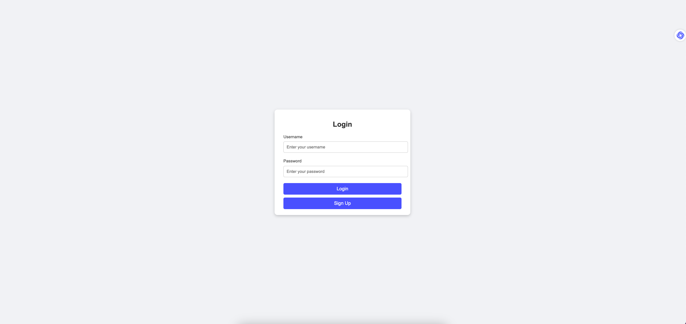
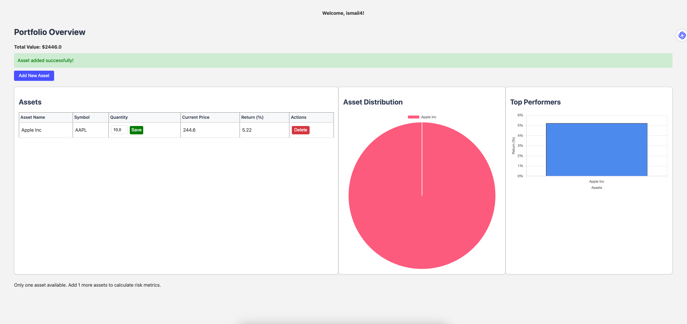
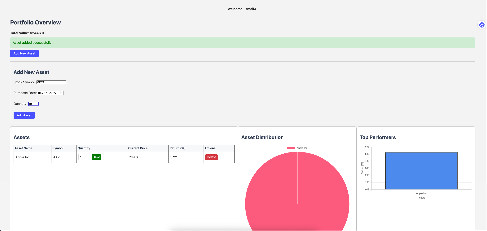
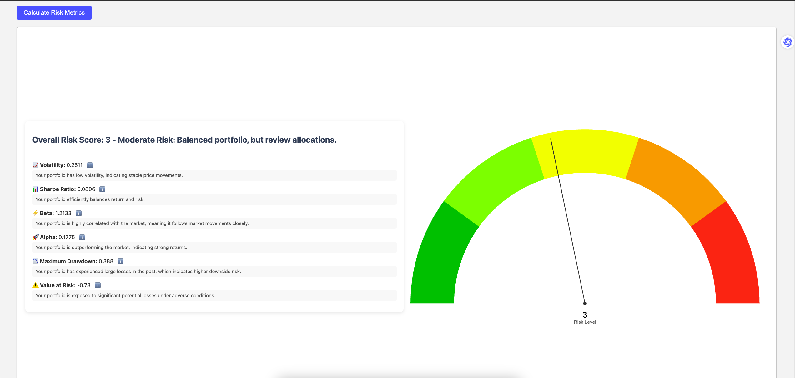

# 📊 Investment Portfolio Risk Analysis Tool  
A **Java & Spring Boot-based application** for evaluating investment portfolio performance and risk exposure.  
This tool calculates key risk metrics and provides users with a **final risk score (1 worst - 5 best)** to assess their investments.

## 🚀 Features
- ✅ **User Accounts & Portfolios** – Create accounts, build portfolios, and add assets.
- ✅ **Risk Metrics Calculation** – Computes *Volatility, Sharpe Ratio, Beta, Alpha, Maximum Drawdown, and Value at Risk (VaR)*.
- ✅ **Risk Score Analysis** – Generates a final *risk score (1-5)* based on calculated metrics.
- ✅ **Real-Time Data** – Fetches financial data from the *AlphaVantage API*.
- ✅ **Risk-Free Rate** – Uses *U.S. Treasury Bills (2-year maturity, daily interval)*.
- ✅ **Local Database Storage** – Stores users, portfolios, assets, and risk metrics in *MySQL*.

## 🛠️ Tech Stack
- **Backend:** Java, Spring Boot
- **Frontend:** HTML, CSS, Thymeleaf
- **Authentication:** Spring Security
- **Database:** MySQL
- **API Integration:** AlphaVantage API (RESTful)

## 🖼️ The Application
### Login Page  
  

### Dashboard  
  

### Adding Asset  
  

### Risk Analysis  
  

## 📈 Risk Metrics Explained
- **Volatility** – Measures portfolio price fluctuations.
- **Sharpe Ratio** – Risk-adjusted return measure.
- **Beta** – Portfolio sensitivity to market movements.
- **Alpha** – Excess return relative to benchmark.
- **Maximum Drawdown** – Largest portfolio loss from peak.
- **Value at Risk (VaR)** – Potential loss at a given confidence level.

## 💡 Future Enhancements
- Deploy on AWS/GCP
- Improve UI/UX with React or Vue.js
- Support more financial data sources
- Add Monte Carlo simulations

## 📩 Contact & Contributions
Feel free to **fork, contribute, or report issues!**  
